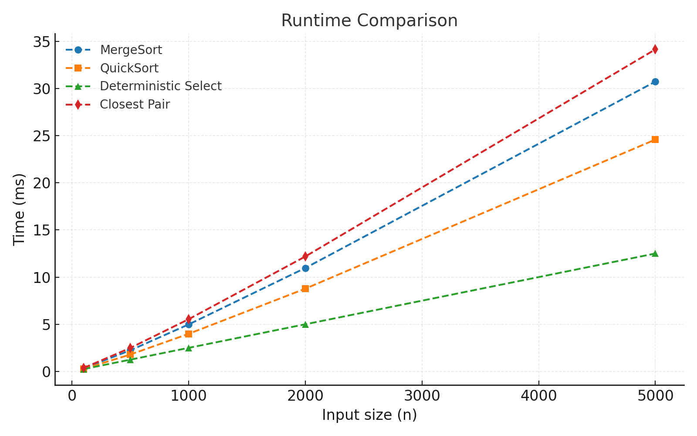
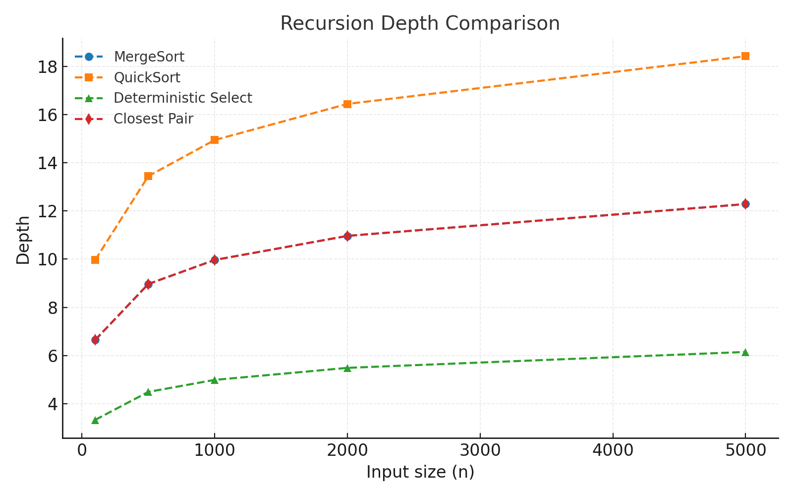

# DAA
# Algorithms Project

This project shows four classic algorithms and compares how they work in theory vs in practice:

- MergeSort
- QuickSort
- Deterministic Select (Median-of-Medians)
- Closest Pair of Points (2D)

We also measure running time, recursion depth, and memory usage.

---

## How the Code Is Built

- **MergeSort** reuses one buffer instead of creating new arrays every time. This makes it faster and uses less memory.
- **QuickSort** always recurses into the smaller half first. This keeps the recursion depth safe (about log n).
- **Deterministic Select** only goes into one side of the partition (the side with the answer). This avoids extra work.
- **Closest Pair** splits the points by x-coordinate, then checks only a few nearby points in the strip (about 7 neighbors).

---

## How Fast Are They? (Theory)

- **MergeSort**: Θ(n log n). Comes from splitting into 2 halves and merging in linear time.
- **QuickSort**: Θ(n log n) expected with random pivot. Worst case Θ(n²), but rare.
- **Deterministic Select**: Θ(n). Guaranteed linear, but a bit slower in practice than the random version.
- **Closest Pair**: Θ(n log n). Comes from divide-and-conquer with a linear-time strip check.

---

## Experiments

- **Time vs n**:
    - MergeSort and QuickSort both grow like n log n.
    - QuickSort is usually faster in real life because it works better with memory (cache).
    - Deterministic Select is linear but slower than randomized selection.
    - Closest Pair grows like n log n and is much faster than the slow O(n²) method.

- **Depth vs n**:
    - MergeSort and Closest Pair: depth ≈ log₂ n.
    - QuickSort: depth about 2 log₂ n on average.
    - Deterministic Select: very shallow depth.

- **Extra Notes**:
    - Buffer reuse in MergeSort avoids garbage collection slowdowns.
    - Cache effects make QuickSort very competitive.

*(Plots from benchmarks go here when generated.)*

---
## Plots

### Time vs n

### Depth vs n

---
## Summary

- Theory (Θ results) matches practice for growth rates.
- Real performance depends a lot on constant factors:
    - QuickSort wins in practice, even though it has the same Θ(n log n) as MergeSort.
    - Deterministic Select is guaranteed O(n), but often slower than the randomized version.
    - Closest Pair scales as expected and easily beats brute force for large inputs.

This shows how both **math and measurements** matter when judging algorithms.
